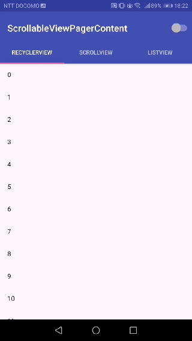

ScrollableViewPagerContent
===============

[](https://maven-badges.herokuapp.com/maven-central/com.h6ah4i.android.scrollableviewpagercontent/scrollableviewpagercontent)


A tiny library which improves UX with ViewPager. This library prioritizes ViewPager's horizontal swipe action over vertical scroll of inner pager contents.

In the standard behavior of Android's ViewPager, paging swipe action of ViewPager has less priority than inner views' vertical scroll. When inner content is in scrolling state, horizontal swipe is completely ignored. However the behavior is considered bad for UX, and that's why I created this library.

Also, I noticed that some major apps implemented the same behavior. (*NOTE: These are not using this library.*)

- Play Store app
- Official Twitter client
- Mercari




Usage
---

### 1. Add the following line(s) to `build.gradle`

```gradle
// the core module
implementation 'com.h6ah4i.android.scrollableviewpagercontent:scrollableviewpagercontent:1.0.0'

// if you are using RecyclerView, add this too
implementation 'com.h6ah4i.android.scrollableviewpagercontent:scrollableviewpagercontent-recyclerview:1.0.0'

// if you are using NestedScrollView, add this too
implementation 'com.h6ah4i.android.scrollableviewpagercontent:scrollableviewpagercontent-nestedscrollview:1.0.0'

// if you are using ListView, add this too
implementation 'com.h6ah4i.android.scrollableviewpagercontent:scrollableviewpagercontent-listview:1.0.0'

```

### 2-A. If using a `RecyclerView` for the `ViewPager` content

```java
RecyclerView rv = ...;
rv.addOnItemTouchListener(new ViewPagerContentRecyclerViewTouchEventInterceptor());
```


### 2-B. If using a `NestedScrollView` for the `ViewPager` content

```diff
- <android.support.v4.widget.NestedScrollView> ...
+ <com.h6ah4i.android.scrollableviewpagercontent.nestedscrollview.ViewPagerContentNestedScrollView> ...

```


### 2-C. If using a `ListView` for the `ViewPager` content

```diff
- <ListView> ...
+ <com.h6ah4i.android.scrollableviewpagercontent.listview.ViewPagerContentListView> ...

```


License
---

This library is licensed under the [Apache Software License, Version 2.0](http://www.apache.org/licenses/LICENSE-2.0).

See [`LICENSE`](LICENSE) for full of the license text.

    Copyright (C) 2018 Haruki Hasegawa

    Licensed under the Apache License, Version 2.0 (the "License");
    you may not use this file except in compliance with the License.
    You may obtain a copy of the License at

        http://www.apache.org/licenses/LICENSE-2.0

    Unless required by applicable law or agreed to in writing, software
    distributed under the License is distributed on an "AS IS" BASIS,
    WITHOUT WARRANTIES OR CONDITIONS OF ANY KIND, either express or implied.
    See the License for the specific language governing permissions and
    limitations under the License.
